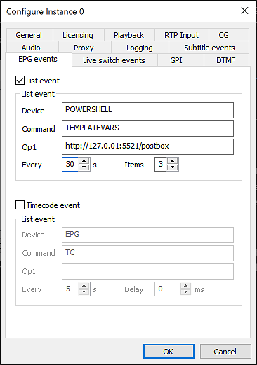

# Automated Dynamic Graphics Using External Datasource With Cinegy Air / Playout

DRAFT

## Introduction

A frequent requirement of customers is to use dynamic elements inside on-screen graphics. At Cinegy, we use the Cinegy Titler engine to render real-time graphics elements for compositing into the output from a Cinegy Playout engine. This engine has a lot of powerful features - as well as being a real-time optimized graphics system, it also supports binding of elements within a graphics scene to imported variables.

Customers can update variables within the Cinegy Air or Cinegy CG operator panels, allowing injection and updating of elements on-the-fly - for example, to caption the name of a person appearing on-screen, or to provide some values for a weather forecast graphic. These could be injected via 'traffic' integration when the rest of the playlist is composed, or entered by operators under instruction from a director in a gallery.

However, sometimes customers don't want to provide data ahead of time into the operator panels - they would rather delegate fulfilment of these variables to some controller that could just make sure that up-to-date values are prepared and injected into the engine ahead of time.

This post focusses on one way that this can be achieved simply through binding to the playout engine EPG event system and then using a PowerShell script to read from a trivial example data source which then ensures those values are made available to the engine.

## Cinegy Playout & The Variable 'Postbox'

There is a concept inside of the universal playout engine we use called informally the 'postbox'. You can use this postbox to ask the engine to use new values for any graphics scenes. The mechanisms can be considered analogous to writing something on a postcard, and then dropping it into a mailbox - the engine will read your postcard, and copy whatever you have written on this into the value for the variable corresponding to the 'address' on the postcard.

There are a few rules about the postbox that are worth considering:

- The last value assigned to a variable 'wins' and becomes the current value
- The postbox is a 'dead drop'; once you drop a something in, you can't change your mind and pull it back out
- The postbox will hold values regardless of if a corresponding scene is actively using those values

It is the last element that can catch people out, although at the same time we will use this to our advantage to meet our needs. It is actually a very useful and powerful capability to be able to set variable values up ahead-of-time and not worry about the relationship to whatever might be currently rendering - but it also means that you need to be careful that variable names are unique if you want them to be isolated. 

For example, it might make perfect sense that a variable for the outside temperature is a globally shared variable - all templates that render can just use that variable and the results would be as expected. However, an item-specific value - maybe the description strap of a caption for a person - could easily cause problems if a variable with a trivial name like 'description' were used. You have been warned!

If you want to see technical details regarding the operations you can carry out via the postbox, or how to see how to carry out such operations, please see the following resources for documentation and examples:

https://open.cinegy.com/posts/2016-09-23-air-rest/

https://open.cinegy.com/products/air/14/playout/cinegy-air-http-api/controlling-cg-engine/

## Triggering Collection

Having established that we wish to put variables for use into the 'postbox' for the engine to use in rendering - we come to the second problem; how to know what values to collect?

Ideally, we would want some form of selective update - so we don't gather every possible variable value, but instead select some specific values and update these at an appropriate moment. We would also want some reliable mechanism to carry out this, preferably simple to set up and with some easy way to see diagnostics. We would also want this to work properly in an high-availability (H/A) setup - so that we don't introduce any single points of failure.

The answer is to use the Cinegy Event Manager service to host the collection, either as a full plugin or as the hosting engine for a PowerShell script. Since explaining how to create a complete Event Manager plugin will take quite a while, we will focus on the latter option - using Event Manager to host a PowerShell script.

Event Manager can run locally to the machine hosting Air Engines, or centrally. Since we want to have the least amount of configuration for this post, and since running locally provides a trivial way to provide H/A (just set up the Event Manager on both Air Engines in a cluster) we will just consider running locally - but the principles will be the same if we had chosen remote hosting.

To start, we shall make a new PowerShell script, using the GitHub hosted reference example script as the basis for our new script - you can get this script here:

https://github.com/Cinegy/Cinegy.Powershell/blob/master/Titler/PushTitlerVariableToPostbox.ps1

The Event Manager configuration is incredibly simple in this case - just 'activate' the PowerShell plugin in side Event Manager configuration, and point it at the reference script. Please note, you will need to have an up-to-date PowerShell version installed on your machine (we built and tested this with the latest v5 engine available at time of writing), and you will need to make sure that you have either signed your script or selected an appropriate ExecutionPolicy for your machine. You can read more about Execution Policies here - please also remember that current Event Manager is a 32-bit application, so you will need to set the policy for the 32-bit copy of PowerShell!

https://docs.microsoft.com/en-us/powershell/module/microsoft.powershell.core/about/about_execution_policies?view=powershell-7

Now we have a solid mechanism to host an activity based on PowerShell, we need some way to reliably trigger that activity as well as provide some input to that activity that would allow us to understand what data we might need to provide. For this, we are going to hook into events the engine raises that are labelled 'EPG events' in the configurator. Events defined in this tab will be raised either by a timer every X second, or as a result of a change of status on the engine (e.g. when the on-air item changes). These events will be raised always, and regardless of if any other controllers such as the Air or CG panels are connected. You can read more about the specifics of these panels in the manual here:

https://open.cinegy.com/products/air/14/playout/user-manual/configuration/subtitle-and-epg-events/


You can also read about the principle behind this, and the predecessor to this set of events (the subtitling events) in this next link related to configuring a subtilting service - it's exactly the same principle, but for on-screen rendering rather than for closed-captions.

https://open.cinegy.com/misc/subtitle-converter/

We can use the 'command' and 'op1' fields to set arbitrary values related to the configuration that will call this event - which we will use to pick what engine to target with data and to provide a quick sanity check that someone has loaded an appropriate script into Event Manager for the task we expect. You can see a screenshot of a suitable configuration below, choosing to use EPG events (although Subtitle events are used in the sample script below - they are functionally identical):



As detailed links above, the system will fill in the 'op2' field with handy XML that describes what is on-air, and what is going to be on air soon - the perfect information for helping process appropriate data variables that will be used soon.

## Putting it together

We have now identified and configured the mechanisms for the following topics:

- Defining regularly firing events that react to changes in playout
- Providing a target for these events in a reliably hosted manner
- Collecting details about what is on-air, and what will soon be on-air
- Collecting details about where to direct any output from the process

Given that we now know what to do, we get reminded with frequency to do it and we get told where to put our work - we just need to focus on doing some work!

For a simple demonstration, and to avoid getting side-tracked by any particular complex data collection, we are going to assume that there is are simple CSV files that will be updated regularly in a folder, and that we will use these files as sources of variables. At this point, we move into pure PowerShell to carry out these actions. Let's list out the steps we need to take within the script:

- Load the script, perform start-up housekeeping (reading inputs, setting up the logger)
- Interpretting the provided XML input to understand what is on-air and cued
- Looking for any matching data file sources for any items by their IDs
- Reading the values from these data sources and organizing them
- Composing a 'postbox' message and sending the message to the engine

The complete script can be accessed here, and it is likely to be polished and adapted as we evolve the product so it might drift a little from the code shown below:

https://github.com/Cinegy/Cinegy.Powershell/blob/master/Titler/AutoVariableReader.ps1

Let's now go through each funciton block described above, highlighting snips from the PowerShell script.

### Housekeeping & Setup

The script starts with some usual elements to prepare for execution:

```Powershell
param($provider)

if($null -eq $provider) {
    Write-Host "Cinegy Provider parameter is null - is this script hosted within EventManager?"
    exit
}

#user configurable defaults here:
$dataFolder = "D:\Data\Dev\GIT\powershell\Titler\DataSamples"
$separatorChar = ";"
```

Within this block, we read the special 'provider' parameter. This is a special object that Event Manager creates and passes into the scripts. It is used to contain all the arguments that come from Event Manager itself, as well as providing a logging object that can be used to push back messages into the core Event Manager log framework.

We also define some variables we will use later on in the main script body - where we can find data files to use as a data source, and what the separator character is within the CSV files we will load.

### Interpretting Input Values and XML

Because in PowerShell you must declare any functions before you use them, the file next contains the functional blocks we will use. For the moment, skip down to the next section which we will described before we go back to the functions:

```Powershell
# ---- MAIN SCRIPT STARTS HERE AFTER FUNCTIONS ---- #

# get logger instance to add information directly into task log
$logger = [Cinegy.PowerShell.Command.Logger]$provider.Logger

if($provider.Arguments.Command -ne "TEMPLATEVARS") {
    $logger.LogWarning("Unexpected command $($provider.Arguments.Command) (expected TEMPLATEVARS) - no action taken")
    exit
}

$serverUrl = $provider.Arguments.Op1
$playlist = [Xml]$provider.Arguments.Op2
```
Above we can see that we start accessing things from the $provider object - the logger and the event arguments.

As well as assigning these values to new variables (just to make accessing them later clearer), there is a short test to see if the provided 'Command' argument matches what this script expects. This is just a sanity check, and helps cause a clear warning if the script that has loaded is the script expected by the configuration in the Playout EPG configuration. It does not do anything functionally - it's just to help avoid mistakes.

### Finding Data Sources
This block is concerned with looking through the playlist 'lookahead' XML provided from the playout engine. We scan the provided XML and check to see if we have a 'titleId' set.

>Warning: A Subtitle or EPG event will be fired by the playout engine as a result of things changing in the look-ahead window as well as periodically. The purpose of the periodic 'pulse' of state is in case some things with a cluster have restarted - it is up to any script implementing actions to ensure they will act either in an idempotent manner or to hold some stateful marker (e.g. a temporary file on disk) that will track the active item and supress duplicate activity. In this case, we just set the periodic refresh to 30 seconds (to avoid excessive running) and don't worry about running multiple times - the Titler template in our case will show no ill effects to having a variable value set to the same value repeatedly.

```Powershell
#check to see if on-air item has a populated titleId that corresponds to any existing file
$variables = GetVariablesForId -ItemId $playlist.titles.onair.titleId -DataFolder $dataFolder -SeparatorChar $separatorChar

if($null -eq $variables) {
    #nothing matched in the check, so now check each cued item - leave loop as soon as something is found
    foreach($cuedItem in $playlist.titles.cue){
        $variables = GetVariablesForId -ItemId $cuedItem.titleId -DataFolder $dataFolder -SeparatorChar $separatorChar
        if($variables) { break }
    }
}
```


> Warning: In the sample script, and shown above, we are using the 'titleId' attribute. This is the attribute provided when the playout engine is set-up using the 'Subtitle' events (just because this is how the customer we created this script for needed to use it initially.) If you are following this guide and have used the EPG event tab, please use the .epgId attribute instead (and set the EPG ID in the playlist)

First it checks the 'onair' item, and if that has no value set it looks through the available cued items. Whatever item is first to have a non-empty titleId is used to as the key when searching for data files.

Having found a key, it then tried to extract variables from this data file in the function described next - GetVariablesForId.

### Finding, Reading & Returning Data 
A function is used in the script, just to help script flow and clarity, to perform the action search for a data source file and to compose a suitable object containing the results of parsing any located file.

```Powershell
#find a file matching the ID to read and split into sub-variables
function GetVariablesForId([string]$ItemId,[string]$DataFolder,[string]$SeparatorChar=","){
    if($itemId.Length -lt 2) { return $null } #only operate on elements with an ID at least 2 chars long - will skip blanks then

    $matchedSources = Get-ChildItem -Path $DataFolder -Name "$($ItemId)*"
    if($matchedSources.Count -gt 0){
        if($matchedSources.Count -gt 1) { 
            $logger.LogWarning("Multiple data sources match ID, taking no action"); 
            return $null 
        }
        $logger.LogInfo("Found data file $($matchedSources) for variable loading")
        return (Get-Content -Path $matchedSources.PSPath) -Split $SeparatorChar
    }
}
```

The code shows that we first discard any keys passed in that don't have at least 2 characters - just because single-digit entries are probably mistakes. In this condition, we just return null - this will be a common case, since a lot of items passed might quite reasonably have no data sources attached.

Once we feel confident to proceed, the script uses PowerShell functions to hunt through the previously defined data sources folder for a file starting with the key value.

> Warning: This script uses a wild-card match, so it will match on the first found item if the search actually yields multiple results. In production, it would be better if codes need a fixed length to be considered valid and this will help avoid some operator error or data source file problems.

Having located a file, the script loads all the text from the file before splitting based on the defined separator char and returning the resulting array of strings. This will return the code flow to the main script, which will then use this for the next step - composting a message to the playout engine 'Postbox'.

### Organizing and naming variables
The final step of the main script involves combining the received data values into a hashtable of variable name/value pairs to be sent to the playout engine and injected into the on-air template.

Below, we can see the block of PowerShell that iterates in a loop through any non-null results from getting data previously.

If it finds any values, it uses the very neat (but slightly confusing) PowerShell features for creating hashtable objects before populating them within a look and creating an in memory table where each of the discovered data values are given a name using a counter $variableNumber.

```Powershell
#if we have found any variables to set, set them
if($variables){
    $varTable = @{}
    for($variableNumber = 1;$variableNumber -le $variables.Count;$variableNumber++){
        $logger.LogInfo("Sending variable Line$variableNumber.Text=$($variables[$variableNumber-1])")
        $varTable.Add("Line$variableNumber.Text",$variables[$variableNumber-1])
    }
    PostVariablesToAir -ServerUrl $serverUrl -VarTable $varTable
}
```

Once this loop completes, there should be at least one variable to push into playout (possibly many). Because the data source in this case is a CSV, the identity of each value is determined by order - but when sending variables to the Cinegy Titler system, all variables must have a specific name. We just used some arbitrary word (in this case 'Line') along with the incrementing counter to assign a unique name - but this does require the targetting .CinTitle template to have correspondingly named variables if you expect to see anything! We created a usable demo template (using Cinegy Titler v15) you can use or evolve here:

https://github.com/Cinegy/Cinegy.Powershell/blob/master/Titler/TitlerScenes/Multiline-Overlay-PAL16x9.cintitle

The last action of the script is to use the function, the final element to describe in the script, named PostVariablesToAir

### Composing A 'Postbox' Message

Perhaps the most complex step in the script is creating an appropriate data structure to represent what we want to send to the engine, and it is wrapped up in this function:

```Powershell
function PostVariablesToAir([string]$ServerUrl,$VarTable){
    $xmlDoc = New-Object System.Xml.XmlDocument;

    $xmlRootElem =  $xmlDoc.AppendChild($xmlDoc.CreateElement('PostRequest'));

    foreach($var in $VarTable.Keys){
        $xmlSetValueElem = $xmlRootElem.AppendChild($xmlDoc.CreateElement('SetValue'));
        $xmlSetValueElem.SetAttribute("Name", $var);
        $xmlSetValueElem.SetAttribute("Type", 'Text');
        $xmlSetValueElem.SetAttribute("Value", $VarTable.$var);
    }
    
    $result = Invoke-RestMethod -Method POST -Body $xmlDoc.OuterXml -ContentType "text/xml; charset=utf-8" -Uri $serverUrl
    if($result.PostReply.Success -ne 1 ) { $logger.LogError("Error in result returned from Air Postbox: $result") }
}
```

This function creates a required XML object, populates it with XML nodes and elements to match the format for the playout system described and linked earier in the post, and the uses the neat 'Invoke-RestMethod' to send the data to the engine. We are selecting the address of the engine from the 'Op2' argument provided in the Event Manager event itself and carried through to the function as $ServerUrl.

If you want to see a more expansive example of composing a postbox message, please take a look at the fully commented script here:

https://github.com/Cinegy/Cinegy.Powershell/blob/master/Titler/PushTitlerVariableToPostbox.ps1

### Summary

And that is it - you should now have a full view of what we are doing, along with why we do it this way and exactly how to do it!

Using this pattern, it is simple to create data-reactive templates that can transform values from external sources (RSS feeds, CSV files, webservices or databases) as an asyncronous task and then call back into the engine to set values.